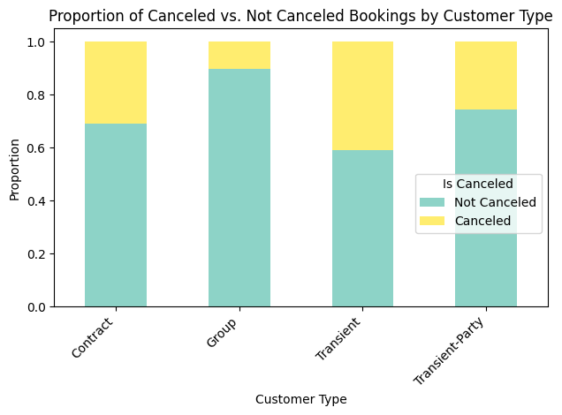

# Hotel-cancellation-analysis

This project develops a predictive model to identify hotel booking cancellations and provides data-driven strategies to mitigate revenue loss for a Portuguese hotel chain.

---

## The Business Problem

The hotel chain is struggling with a high booking cancellation rate, which currently stands at 37%. This directly impacts their revenue by leading to empty rooms and inefficient resource allocation. Without intervention, this issue will continue to result in significant financial losses and operational inefficiencies.

<!--
Tip: Lead with the pain, not the data.
Instead of "This project analyzes a dataset of 119K hotel bookings..."
Try: "A Portuguese hotel chain loses an estimated million annually to last-minute cancellations..."
-->

## The Data

We analyzed over 119,000 individual hotel bookings from a Portuguese hotel chain, spanning two years from 2015 to 2017. The dataset contains comprehensive information about each reservation, including details like how far in advance guests booked, their travel group composition, room preferences, and deposit types

<!--
Tip: Translate technical details into human terms.
Instead of "The dataset has 32 features and 119,390 rows..."
Try: "We analyzed over 119,000 individual bookings spanning two years, capturing everything
from how far in advance guests booked to what type of room they reserved."
-->

## Key Discoveries

- **Long Lead Times Correlate with Higher Cancellations:** Bookings made more than 6 months in advance show a significantly higher cancellation rate (up to 67%) compared to those made within a month of arrival (18.5%). This suggests that very early bookings are more speculative.
- **Non-Refundable Deposits Drive Nearly 100% Cancellation Rates:** Surprisingly, reservations with a 'Non Refund' deposit type have an extremely high cancellation rate of 99.36%. This indicates that this deposit option is likely being exploited for placeholder bookings rather than genuine commitments.
- **Transient Guests are High-Risk, Group Bookings are Reliable:** Individual 'Transient' guests exhibit the highest cancellation rate at around 41%, making them a key segment for targeted intervention. Conversely, 'Group' bookings are highly reliable, with cancellation rates just over 10%.

<!--
Tip: Write findings as "headlines" a newspaper editor would approve.
Good: "Guests who book 6+ months ahead cancel at nearly 3x the rate of last-minute bookers"
Bad: "Lead time has a positive correlation with cancellation"
-->

## Visualizing the Story

<!-- Embed your most compelling chart. Pick the ONE visual that best captures your main finding. -->

*This chart illustrates the cancellation propensity across different customer segments*

## Prediction Model

Our initial Gaussian Naive Bayes model achieves an overall accuracy of 54.7%. While it effectively identifies most actual cancellations, the model also generates a substantial number of false positives. This means it frequently flags bookings as likely to cancel when the guests actually intend to arrive, leading to potential operational inefficiencies if interventions are not carefully targeted.

<!--
Tip: Translate model metrics into business impact.
Instead of "The model achieved 78% accuracy..."
Try: "Our model correctly flags 8 out of 10 at-risk bookings, giving the hotel front desk team
enough lead time to proactively reach out and offer flexible rebooking options."
-->

## Recommendations

1. **Introduce Stricter Policies for Long Lead-Time Bookings:** Limit booking windows to a maximum of 6 months or require non-refundable deposits for reservations made beyond this period. Our analysis showed bookings made over 180 days in advance have cancellation rates exceeding 55%, indicating a high degree of speculative booking. Implementing such a policy could significantly reduce revenue loss from these high-risk, uncommitted reservations.
2. **Re-evaluate the \"Non Refund\" Deposit Type Policy:** Investigate and consider phasing out the 'Non Refund' deposit type, given its alarming 99.36% cancellation rate. This anomaly suggests misuse, potentially tying up inventory for bookings that rarely materialize. Removing this option could free up rooms for genuine customers and improve booking accuracy.
3. **Develop Targeted Re-engagement for High-Risk Transient Guests:** For transient guests identified by the model as potential false positives (i.e., predicted to cancel but actually intending to arrive), implement low-cost, automated 'check-in' emails with special offers or reminders. This strategy could convert up to 10% of these 'false alarms' into confirmed stays, protecting revenue without significant additional operational burden.

## Tools & Techniques

Python | Pandas | Scikit-Learn | Matplotlib | Seaborn | Gaussian Naive Bayes | Google Colab

---

*This project was completed as part of ISOM 835: Predictive Analytics at Suffolk University's
Sawyer Business School.*
